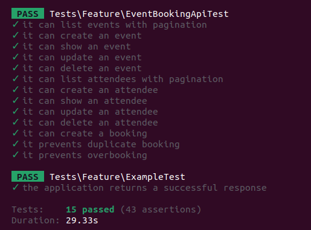
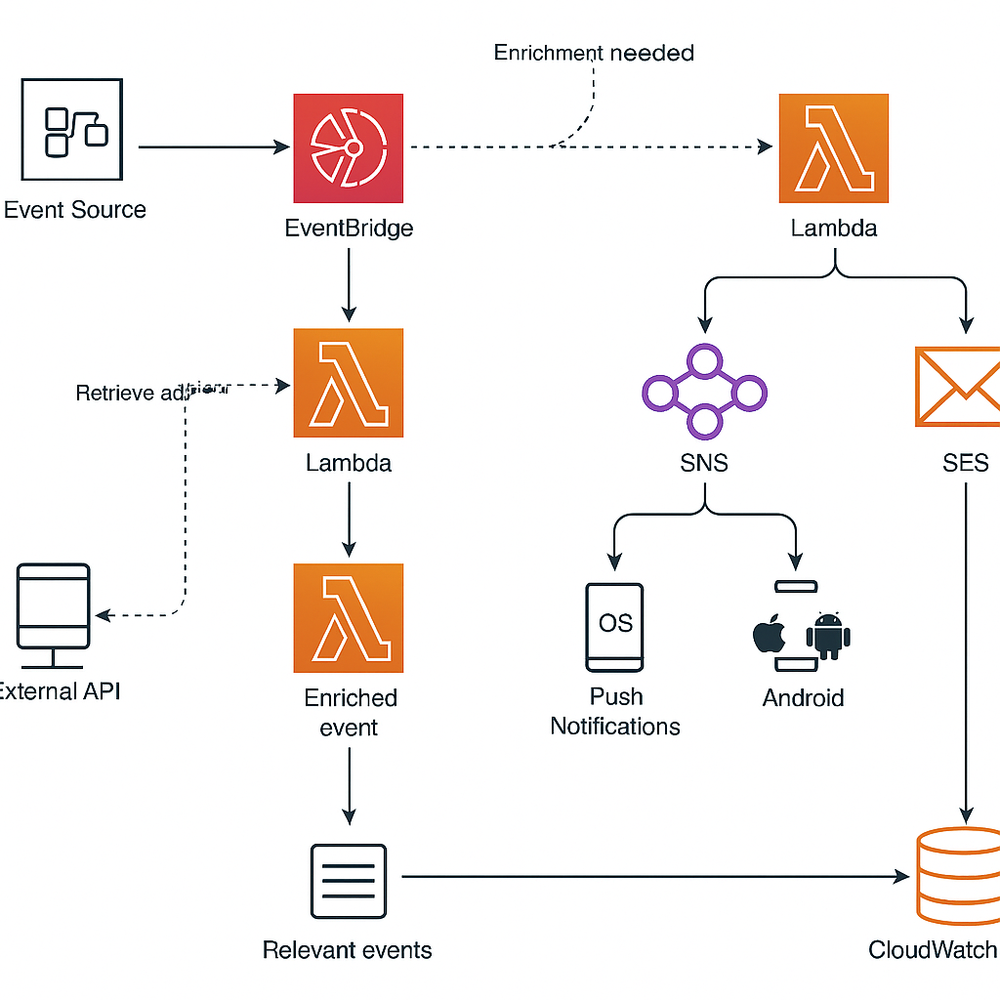

# Event Booking API

A RESTful API built with Laravel for managing events, attendees, and bookings. This API supports event creation, attendee registration, and event booking with pagination and standardized JSON responses.

## Features

- **Events:** Create, update, list (with pagination), show, and delete events.
- **Attendees:** Register, update, list (with pagination), show, and delete attendees.
- **Bookings:** Book attendees for events, with checks for duplicate bookings and event capacity.
- **Standardized API Responses:** All endpoints return consistent JSON structures.
- **Resource Classes:** Uses Laravel API Resources for formatting responses.

## Endpoints

### Events

- `GET /api/events` — List events (paginated)
- `POST /api/events` — Create event
- `GET /api/events/{id}` — Show event
- `PUT /api/events/{id}` — Update event
- `DELETE /api/events/{id}` — Delete event

### Attendees

- `GET /api/attendees` — List attendees (paginated)
- `POST /api/attendees` — Register attendee
- `GET /api/attendees/{id}` — Show attendee
- `PUT /api/attendees/{id}` — Update attendee
- `DELETE /api/attendees/{id}` — Delete attendee

### Bookings

- `POST /api/bookings` — Book an attendee for an event

## Response Format

All API responses follow this structure:

```json
{
  "success": true,
  "message": "Descriptive message.",
  "data": { /* resource or collection */ },
  "meta": { /* pagination info, if applicable */ }
}
```

On error:

```json
{
  "success": false,
  "message": "Error message.",
  "error": "Detailed error message"
}
```

## Setup

1. **Clone the repository:**
   ```bash
   git clone <repository-url>
   cd event-booking-api
   ```

2. **Install dependencies:**
   ```bash
   composer install
   ```

3. **Copy and configure environment:**
   ```bash
   cp .env.example .env
   # Edit .env with your database credentials
   ```

4. **Generate application key:**
   ```bash
   php artisan key:generate
   ```

5. **Run migrations:**
   ```bash
   php artisan migrate
   ```

6. **Serve the API:**
   ```bash
   php artisan serve
   ```

## Testing

You can use tools like [Postman](https://www.postman.com/) or [curl](https://curl.se/) to interact with the API endpoints.

## License

This project is open-source and available under the [MIT License](LICENSE).



# Serverless Notification Service Architecture

